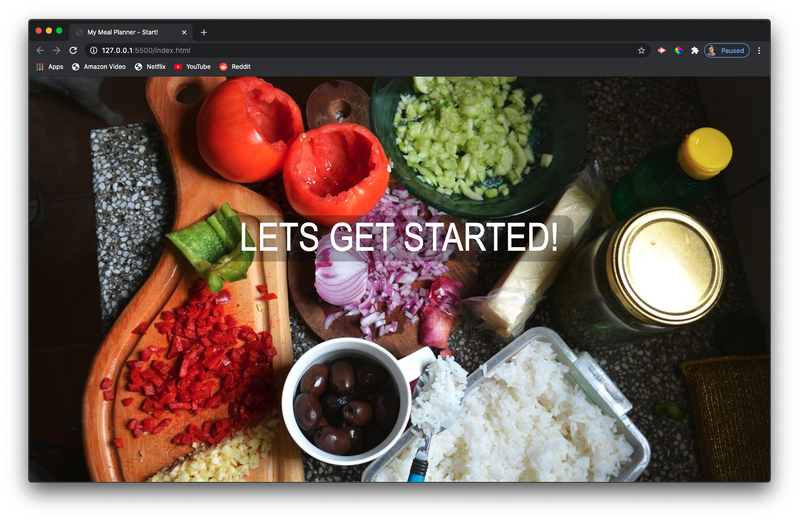
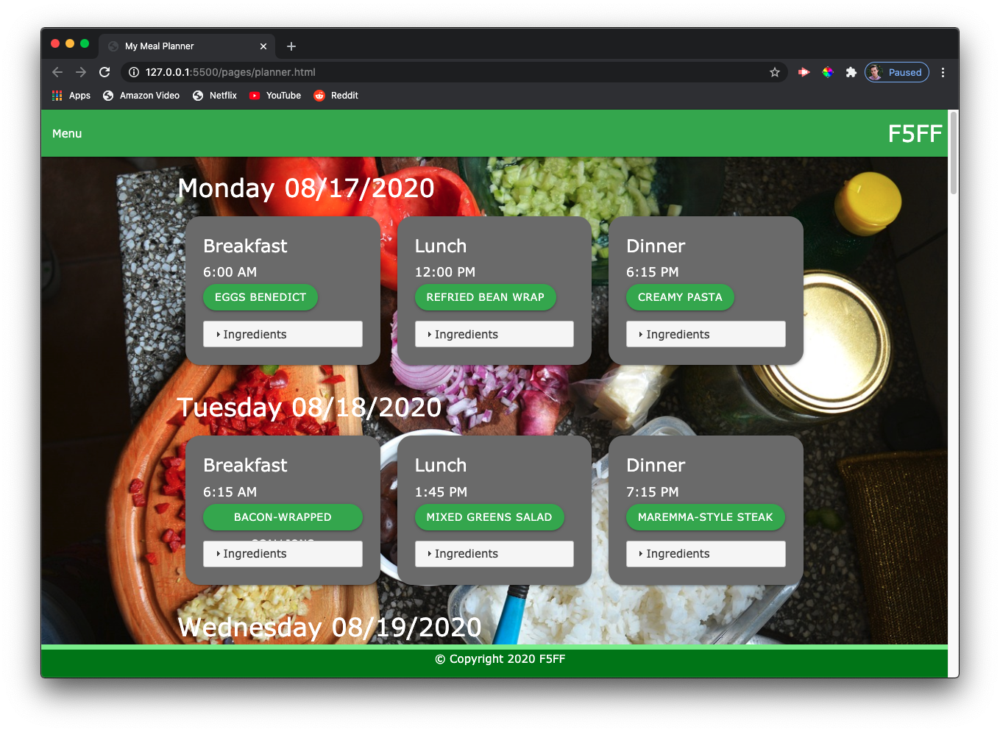
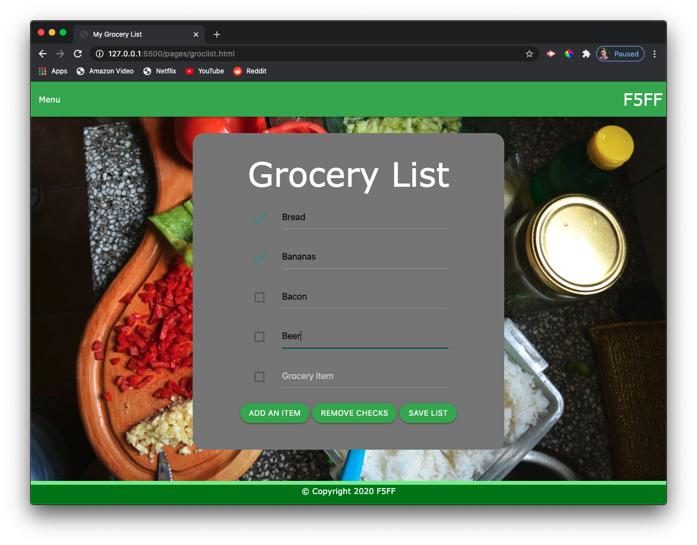
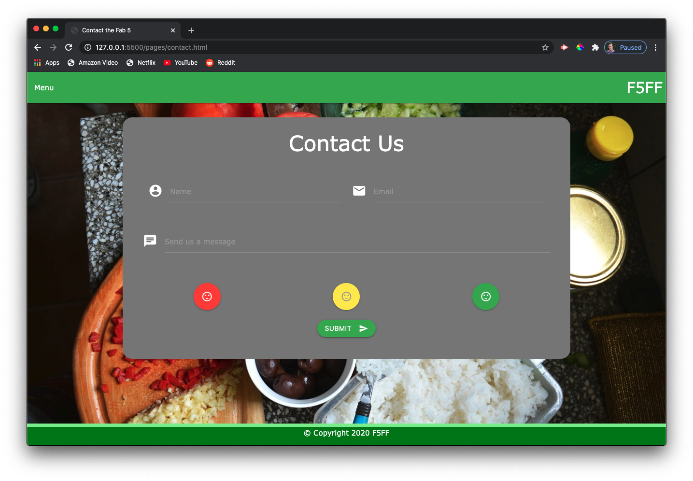

# The Fab Five's Fantastic Foods

## Table of Contents

 * [Description](#description)
 * [Usage](#usage)
 * [Tests](#tests)
 * [Contributors](#contributors)
 * [APIs](#apis)
 * [Badges](#badges)
 * [License](#license)

## Description

The Fab Five's Fantastic Foods is our first project for our UCSD Extention Full Stack Boot-camp. The assignment was to create something people needed, using third-party and server-side API's, a CSS framwork, and user interaction. We settled on a meal planner because we ourselves were in need of one. This project was put together in a short 2 weeks. Ane we are ultimately proud of our work.

This is a meal planner that not only helps you keep track of breakfast, lunch, and dinner. But it also let's you search for recipes to add to your schedule, and has an interactive grocery list. We also have a contact page to report any issues or ask for help.

[Meal Planner deployed link](https://tbsanders5.github.io/mealplanner/)

## Usage

When you first enter the meal planner, click "Lets Get Started!" to go to the actual page.

When you get to the planner page, scroll to the bottom and search a recipe, you will have many options to choose from, you can then add them to the planner by selecting that day of the week, meal, and time. When you scroll back up you will see your changes. You can then click on the Recipe Link to be taken to the website hosting your recipe, or you can click on the Ingredients dropdown to see what ingredients you will need and how much.

On the Grocery List page, you can create a grocery list based off of your meals, which will remember all your entires session to session. "Add an Item" to... add an item, check things you bought (or changed your mind about) and click "Remove Checks" to remove them, and finally, "Save List" to save all of your changes. Reload the page and all your entries will be there!

On the Contact page, you can reach out to us to help with the application. Fill out your name, Email, message, and a little emoji displaying your feelings. Hit "Submit" to send your message to a special email for the application.

## Tests

1. Play around on the planner page. Check out all the recipes available. Add recipes with dates and times.
2. In the Grocery List, fill out boxes, check some filled out boxes and leave others empty, check and un-check empty boxes. Click "Save List", reload the page, and see what pops up!

## Contributors

This Meal Planner was made though that combined efforts of the Fab 5:

 * [Timothy Sanders](https://github.com/tbsanders5) - HTML and JavaScript
 * [Nicholas Konzen](https://github.com/NTKonzen) - HTML and JavaScript
 * [Kira I. Lowrey](https://github.com/KILowrey) - HTML and JavaScript
 * [Talia Vazquez](https://github.com/taliavazquez) - CSS and Materialize
 * [Zachary Bryan](https://github.com/zacharybryan) - CSS and Materialize

## APIs

[jQuery](https://jquery.com/)

> "jQuery is a fast, small, and feature-rich JavaScript library. It makes things like HTML document traversal and manipulation, event handling, animation, and Ajax much simpler with an easy-to-use API that works across a multitude of browsers."

[jQuery UI](https://jqueryui.com/)

> "jQuery UI is a curated set of user interface interactions, effects, widgets, and themes built on top of the jQuery JavaScript Library."

[JotForm](https://www.jotform.com/)

> "Easy-to-use online form builder for every business. Create online forms and publish them. Get an email for each response. Collect data."

[Materialize](https://materializecss.com/)

> "Material Design is a design language that combines the classic principles of successful design along with innovation and technology."

[EDAMAM](https://developer.edamam.com/) [Recipe Search API](https://developer.edamam.com/edamam-recipe-api)

> "Edamam's Recipe Search API lets you integrate recipes and faceted recipe search into your websites or mobile applications."

## Badges

---

## License

© Copyright 2020 F5FF

GNU GENERAL PUBLIC LICENSE Version 3